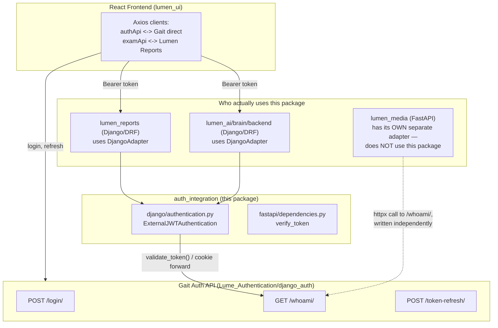
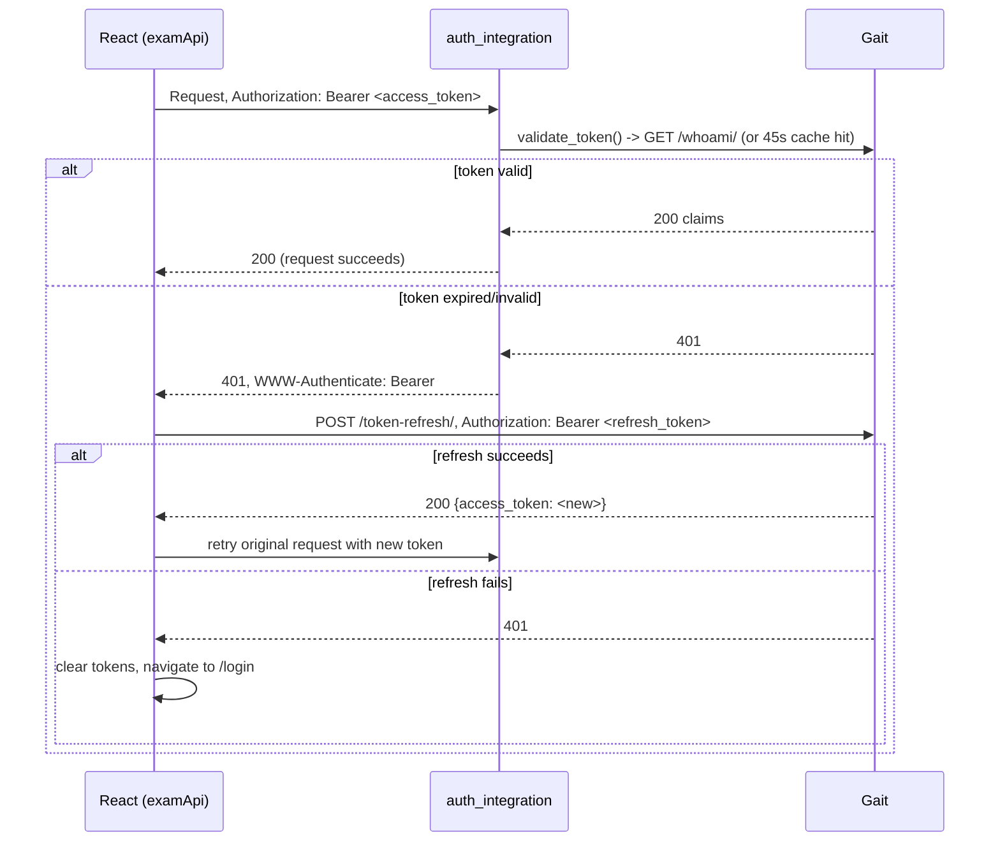

# auth_integration

[](https://opensource.org/licenses/MIT)
[](https://www.python.org/)
[](https://github.com/anthonynarine/auth_integration/releases)

A reusable authentication adapter for **Django REST Framework** and **FastAPI** services that delegate identity to a single external Auth API — **Gait**.

This package is the *only* thing standing between a Lumen backend and Gait. It never issues tokens, never stores passwords, and never knows what an "organization" or "exam" is — it answers exactly one question, on every request: **is this identity valid, and who is it?**

---

## 🧭 Where this fits in the Lumen ecosystem



**Be precise about who's actually a consumer.** `lumen_reports` and `lumen_ai/brain/backend` both wire up `ExternalJWTAuthentication` from this package. `lumen_media` does **not** — it has its own hand-written FastAPI adapter (`app/core/auth_integration_fastapi.py`) that independently calls Gait's `/whoami/`. If you're fixing a bug here expecting it to also fix Media, it won't — check `app/core/auth_integration_fastapi.py` separately.

---

## Why this exists

In a multi-service system, you want **one source of truth** for identity:

- Gait owns users, passwords, 2FA, token issuance, and refresh.
- Downstream services (Reports, the AI Brain, and anything else added later) should **only validate** the incoming request and use the returned **claims** for authorization — never store credentials themselves.

`auth_integration` is the thin adapter layer that makes "only validate, never issue" easy and consistent across every Django/DRF service that needs it.

---

## What you get

### Django REST Framework (DRF)
- `ExternalJWTAuthentication` — a DRF authentication backend
- Returns an authenticated `ClaimsUser` (no local DB user required)
- Attaches `request.user_claims` for downstream permissions and auditing
- Supports **Bearer mode** (`Authorization` header — used in DEV) and **Cookie mode** (HttpOnly cookies forwarded to `/whoami/` — used in PROD)
- Correctly advertises `WWW-Authenticate: Bearer`, so auth failures return a real `401` — not a permission-shaped `403` (see [Correctness guarantee](#-correctness-guarantee-401-vs-403) below)

### FastAPI
- `auth_integration.fastapi.dependencies.verify_token` — an async dependency
- Validates Bearer tokens against `/whoami/` and returns claims for your routes

---

## 🔒 Correctness guarantee: 401 vs 403

This is the single most important behavioral contract this package makes, and it was **broken until v0.3.12** — worth understanding even if you never touch this code again.

DRF has a subtle default: `AuthenticationFailed`/`NotAuthenticated` exceptions get silently rewritten from `401` to `403` by `APIView.handle_exception` whenever *no authenticator on the view advertises a `WWW-Authenticate` challenge header*. Before v0.3.12, `ExternalJWTAuthentication` didn't define `authenticate_header()`, so **every expired or invalid token came back as a 403**, indistinguishable from a real permission failure.

Why that matters: any frontend that does the standard "catch 401, refresh the token, retry" pattern will correctly **ignore** a 403 — 403 legitimately means "authenticated but not permitted" (e.g. a technologist blocked from an owner-only action) and must never trigger a token refresh. So the silent 401→403 rewrite didn't just look wrong in logs — it **silently disabled token refresh** for every consuming service, for every user, always. Sessions just died every 15 minutes (the access token's lifetime) with no recovery.

**Fixed in `v0.3.12`**: `ExternalJWTAuthentication.authenticate_header()` now returns `"Bearer"`, which tells DRF this authenticator can present a real 401 challenge — so it stops downgrading the status code. Verified against live Gait with an invalid token: response flipped from `403` to a genuine `401` with `WWW-Authenticate: Bearer`.

**The lesson for future maintainers**: any custom DRF `BaseAuthentication` subclass that skips `authenticate_header()` has this bug by default. It's not optional.

---

## Claims contract

`/api/whoami/` is expected to return at least:

```json
{
  "id": "...",
  "first_name": "...",
  "last_name": "...",
  "email": "...",
  "role": "admin | physician | technologist",
  "is_2fa_enabled": false
}
```

> Passwords are never returned, ever.

**`role` is an opaque, consuming-application-defined string** — this package does not define or restrict a role vocabulary. Lumen currently uses `admin` / `physician` / `technologist`, but that's Lumen's business-role vocabulary, not something the SDK's identity contract requires; a different consuming application can use entirely different role strings and this package will validate/carry them the same way (any non-empty string). The only runtime requirement is that `role`, like every other required claim field, is a non-empty string — a missing, non-string, or empty `role` fails closed (see [Error behavior](#error-behavior)).

---

## Installation

```bash
pip install "auth_integration[django] @ git+https://github.com/anthonynarine/auth_integration.git@v0.3.12"
```

Or, for a FastAPI service:

```bash
pip install "auth_integration[fastapi] @ git+https://github.com/anthonynarine/auth_integration.git@v0.3.12"
```

Pin to an exact **commit hash** instead of a tag if you want reproducibility independent of tag mutation:

```bash
pip install "auth_integration[django] @ git+https://github.com/anthonynarine/auth_integration.git@9499defd80eb147cbd38f6b5d88c6218fc8bb18f"
```

Both `lumen_reports/requirements.txt` and `lumen_ai/brain/backend/requirements.txt` currently pin by commit hash, not tag — check those files for the exact convention each consumer uses before assuming.

### Requirements / installation extras
- Python 3.10+
- Core (always installed): `httpx`, `python-decouple`
- `auth_integration[django]` — adds `djangorestframework`, `asgiref` (Django itself installs transitively via djangorestframework) for `ExternalJWTAuthentication`
- `auth_integration[fastapi]` — adds `fastapi`, `starlette` for `verify_token`/`get_current_user`
- `auth_integration[test]` — adds `pytest`, `pytest-asyncio` to run this package's own test suite

A consumer only needs the extra(s) matching the framework(s) it actually uses — installing `auth_integration` alone (no extras) gives you the framework-agnostic core (`client.py`, `settings.py`, `exceptions.py`, `utils.py`) without pulling in Django or FastAPI at all.

---

## Configuration

Set in your service's environment (`auth_integration.settings` reads these):

| Variable | Purpose |
|---|---|
| `GAIT_AUTH_URL` | Base URL of the Auth API, e.g. `https://.../api` |
| `GAIT_TIMEOUT` | HTTP timeout in seconds (default `5`) |

---

## Django (DRF) quickstart

### 1) Configure DRF authentication

```python
# settings.py
REST_FRAMEWORK = {
    "DEFAULT_AUTHENTICATION_CLASSES": [
        # Always import from here — the stable public entrypoint (see Versioning below)
        "auth_integration.authentication.ExternalJWTAuthentication",
    ],
}
```

### 2) Use `request.user` + `request.user_claims`

```python
# views.py
from rest_framework.permissions import IsAuthenticated
from rest_framework.response import Response
from rest_framework.views import APIView

class WhoAmIView(APIView):
    permission_classes = [IsAuthenticated]

    def get(self, request):
        return Response(
            {
                "user": str(request.user),
                "claims": getattr(request, "user_claims", None),
            }
        )
```

### Cookie mode (HttpOnly sessions)

If no `Authorization: Bearer ...` header is present, the DRF adapter validates by forwarding auth cookies to `/whoami/`. To keep this fast and predictable, cookie-mode validation only runs when at least one of these cookies exists: `access_token`, `refresh_token`, `temp_token`.

---

## FastAPI quickstart

```python
from fastapi import FastAPI, Depends
from auth_integration.fastapi.dependencies import verify_token, get_current_user

app = FastAPI()

@app.get("/secure")
async def secure_endpoint(claims=Depends(verify_token)):
    return {"user": claims["email"], "role": claims["role"]}

# A downstream dependency (or another route) that doesn't want to redeclare
# Depends(verify_token) can read the same already-verified claims back:
@app.get("/secure-again")
async def secure_again(claims=Depends(verify_token), current=Depends(get_current_user)):
    assert current == claims  # same verified identity, read a second way
    return {"user": current["email"]}
```

**Contract**: `verify_token` both returns the verified claims *and* attaches them to `request.state.user`, so `get_current_user(request)` reflects the exact same identity for any dependency/route that runs after `verify_token` in the same request. `get_current_user` never validates anything itself — for a request where `verify_token` hasn't run (e.g. a route with no auth dependency at all), it returns `{}`, not an error.

**Bearer-only, intentionally.** Unlike the Django adapter, the FastAPI dependency only supports `Authorization: Bearer <token>` — there is no cookie-mode equivalent. This mirrors what FastAPI consumers of Gait actually need today (no current FastAPI consumer of this package uses cookie-based sessions); if a future consumer needs cookie-mode, it should be added the same additive way Django's adapter grew it on top of Bearer-mode, not assumed.

---

## Authorization (RBAC) guidance

`auth_integration` intentionally focuses on **authentication** (who you are). Your services implement **authorization** (what you can do).

- `auth_integration`: validates credentials, returns `ClaimsUser`, attaches `request.user_claims`.
- Your service (e.g. `lumen_reports`): defines the actual permission rules — role checks, object-level checks, tenant-membership checks. See `auth_integration.permissions.HasRole` / `HasAnyRole` for simple role gating, or build your own (Lumen's `organizations.permissions.IsOrgMember` is a real example of a service-specific permission built on top of this package's claims).

This keeps the shared library lightweight and undomained — it never needs to know about exams, organizations, or any other business concept.

**Fail-closed guarantee.** `HasRole`, `HasAnyRole`, and `require_role` never silently grant access just because a framework-specific implementation is unavailable. Under DRF they're real `BasePermission` subclasses. In a DRF-less (FastAPI-style) environment, `HasRole`/`HasAnyRole` are called directly against a verified claims dict (`checker.has_permission(claims)` — not wired into any FastAPI dependency-injection mechanism, since FastAPI has no `permission_classes` equivalent) and `require_role` is a decorator expecting the wrapped route to receive its claims via a `claims=Depends(verify_token)` keyword argument. In every case — missing claims, non-dict claims, or a role mismatch — the result is **deny**, never an accidental pass-through. See `auth_integration/docs/permissions.md` for the full contract.

---

## Error behavior

| Condition | Result |
|---|---|
| No credentials presented | Returns `None` — request proceeds as anonymous, letting DRF's permission classes decide (e.g. `IsAuthenticated` rejects it) |
| Invalid / expired token | `AuthenticationFailed` → a real **401**, with `WWW-Authenticate: Bearer` (fixed in v0.3.12 — see above) |
| Auth API unreachable or misconfigured | `AuthServiceUnavailable` → **503** |
| Malformed claims payload from Gait | Treated as untrusted, fails closed → **401** |

---

## 🧬 Token lifecycle across the whole stack

This package only handles the "validate one request" slice. The full picture — where tokens are stored, how refresh works, and what the frontend does on failure — spans the React client, this package, and Gait together:



This package has no opinion about refresh — that's entirely client-side (`authInterceptor.ts` in `lumen_ui`). Its only job is making sure the failure case above is a real `401`, so the client's refresh logic actually has something to react to. The full end-to-end trace, including two real bugs found and fixed in this exact flow, lives in Lumen's own docs: `Lumen/docs/security/Auth_Token_Lifecycle_End_To_End.md`.

---

## Development

```bash
python -m venv venv
venv\Scripts\activate   # Windows
source venv/bin/activate  # macOS/Linux

pip install -e .
pytest -v
```

An **editable install** (`pip install -e .`) is what both `lumen_reports` and `lumen_ai` use locally — it points straight at this source folder, so code changes here are live immediately in both, with no reinstall needed. That's a local-dev convenience only: it does *not* mean `requirements.txt` is unpinned — a fresh install anywhere else still gets whatever commit/tag is pinned there.

---

## Releasing a new version

There are **two separate things** that need to happen, and it's easy to do only one and think you're done (ask me how I know):

1. **Git tag** — `git tag vX.Y.Z && git push origin vX.Y.Z` makes the version installable via pip, but does **not** show up as a release on GitHub.
2. **GitHub Release** — a separate object (title + changelog body), created via the web UI at `github.com/anthonynarine/auth_integration/releases/new` or `gh release create`. This is what the Releases page actually shows, and what every prior version (v0.3.2 through v0.3.11) has. **Pushing a tag alone leaves the Releases page showing the previous version as "latest."**

### The actual steps

```bash
# 1. Bump the version
./bump_version.sh X.Y.Z
# (updates pyproject.toml + README version references, commits, tags, and pushes both)

# 2. Create the GitHub Release (bump_version.sh does NOT do this step)
#    Via web UI: github.com/anthonynarine/auth_integration/releases/new
#    Tag: vX.Y.Z | Title: "Title: vX.Y.Z" | Body: the fix commit's summary line
#
#    Or via gh CLI, if installed:
gh release create vX.Y.Z --title "Title: vX.Y.Z" --notes "One-line summary of the fix"
```

### Then update consumers

```bash
# In each consumer's requirements.txt (lumen_reports, lumen_ai/brain/backend, ...):
auth_integration @ git+https://github.com/anthonynarine/auth_integration.git@<new commit hash or vX.Y.Z tag>

# Reinstall (skip this if the consumer uses an editable install — see Development above)
pip install --upgrade -r requirements.txt

# Restart the backend service
python manage.py runserver
```

See `docs/VERSION_BUMP_GUIDE.md`, `docs/RELEASE_CHECKLIST.MD`, and `docs/UPDATE_BACKENDS.md` for the full checklists.

---

## Versioning & stability

DRF loads authentication classes by **string import path**. To avoid breaking consumers when internal modules move, always use the stable entrypoint:

✅ `auth_integration.authentication.ExternalJWTAuthentication`

This is a thin re-export (`auth_integration/authentication.py`) pointing at the real implementation in `auth_integration.django.authentication` — the same class either way, just a stable name that survives internal refactors. Internals under framework folders (`auth_integration.django.*`, `auth_integration.fastapi.*`) may move without breaking anyone who imported from the stable path.

---

## Maintainer

Maintained by **Anthony Narine**
© 2025 — Released under the MIT License
