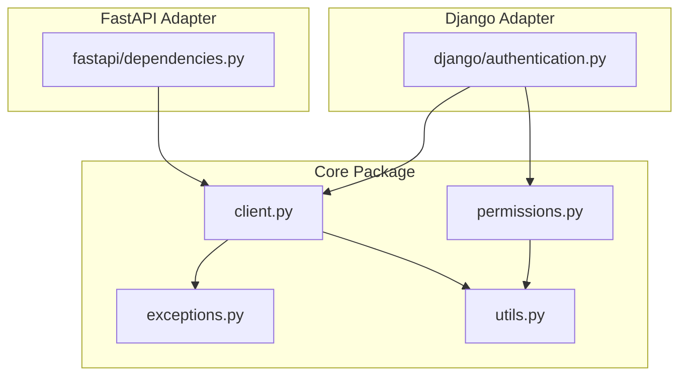
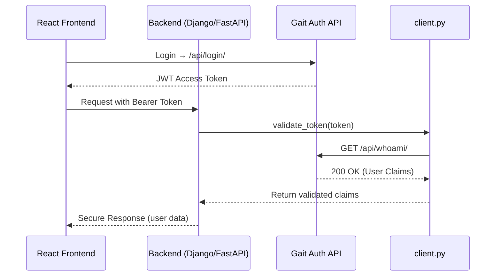

# 🧩 Auth Integration — Module Overview

## Overview
The **Auth Integration** package provides a unified authentication system for Django and FastAPI services that connect to the **Gait Auth API**.

It validates JWTs and extracts user claims. **Actual current consumers**: `lumen_reports` and `lumen_ai/brain/backend` (both Django/DRF, both use `ExternalJWTAuthentication`). `lumen_media` does **not** use this package — it has its own independent FastAPI adapter (`app/core/auth_integration_fastapi.py`) that calls Gait directly. Don't assume a fix here reaches every service; check each consumer's imports before relying on that.

---

## 🧠 Architecture Diagram

---

## 📘 Module Responsibilities

| Module | Role | Used By |
|---------|------|---------|
| `client.py` | Async JWT validator calling Gait `/whoami/` | Django & FastAPI |
| `exceptions.py` | Central exception classes for validation errors | All |
| `permissions.py` | Role-based DRF permission classes | Django |
| `utils.py` | Helper utilities for claims & roles | All |
| `django/authentication.py` | Authentication backend for DRF | Django |
| `fastapi/dependencies.py` | Async dependency for route protection | FastAPI |
| `settings.py` | Reads `GAIT_AUTH_URL` / `GAIT_TIMEOUT` / `GAIT_APPLICATION_CREDENTIAL` from Django settings or `.env`, framework-agnostic | All |
| `authentication.py` (top-level) | Stable public re-export of `django/authentication.py`'s `ExternalJWTAuthentication` — import from here, not the internal path | Django |
| `application.py` (SDK2) | `ApplicationPrincipal` + `verify_application()` — machine/software identity, verified against Gait's `/applications/verify/`. Framework-agnostic; see `AuthIntegration_Application_Identity.md` | All |
| `context.py` (SDK3) | `SecurityContext` — composes an already-verified human identity and/or `ApplicationPrincipal`. No verification, no I/O, framework-agnostic; see `AuthIntegration_SecurityContext.md` | All |

---

## 🧩 Token Lifecycle

---

Maintained by **Anthony Narine**  
© 2025 — Auth Integration Project
