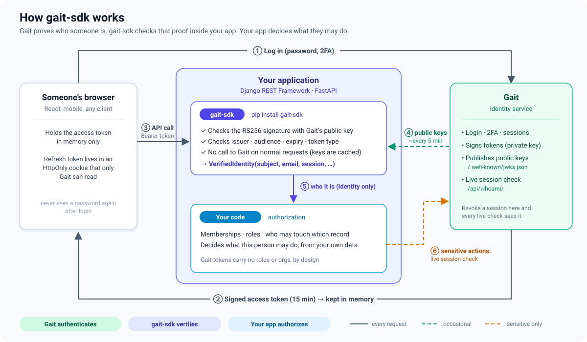
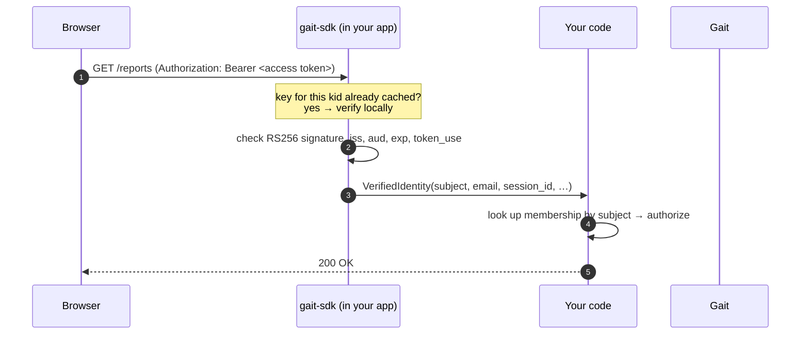
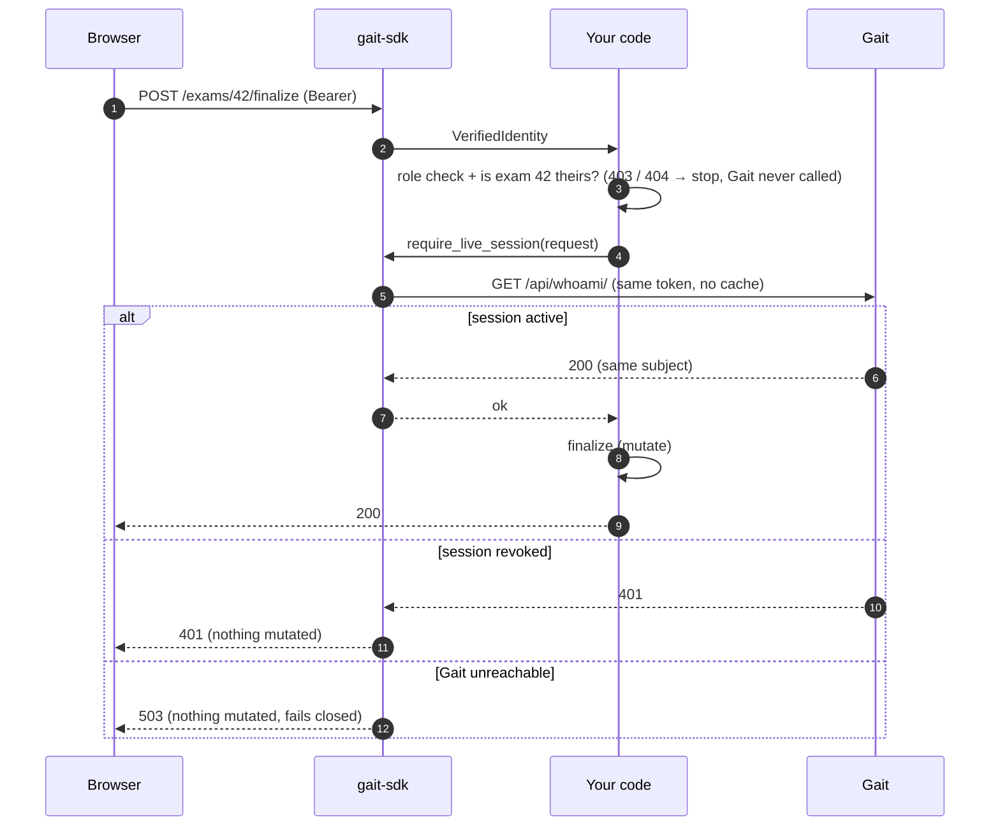

# Architecture



## The three flows

**A normal request: no call to Gait at all**


**A sensitive action: your rules first, then a live check with Gait**


**Key rotation: a token signed with a brand-new key**
```mermaid
sequenceDiagram
    autonumber
    participant S as gait-sdk
    participant G as Gait
    Note over S: token arrives with kid "k2" (not cached)
    S->>G: GET /.well-known/jwks.json (one forced refresh; other threads wait)
    G-->>S: { keys: [k2, …] } (replaces the cached set)
    S->>S: verify with k2 ✓
    Note over S: another unknown kid within 30 s → 401 immediately,<br/>no fetch (stops random-kid flooding)
```

## The boundary

| Layer | Responsibility | Never does |
|---|---|---|
| **Gait** (identity service) | Authenticates people: login, 2FA, sessions. Issues and signs access tokens, publishes its public keys (JWKS), answers live session questions. | Knows your app's roles, orgs or data |
| **gait-sdk** (this package, runs *inside* your service) | Verifies a presented token and normalizes it into a `VerifiedIdentity` | Grants, checks or carries roles, organizations, permissions |
| **Your application** | Authorizes: memberships, roles, object access, workflow rules | Parses tokens itself or trusts unverified claims |

Keeping these apart is what lets the same Gait identity serve several applications with completely different permission models, and keeps each layer small enough to secure and test.

## What runs where

```
 ┌────────────────────────── your service process ──────────────────────────┐
 │  request ─► framework adapter ─► TokenVerifier ─► VerifiedIdentity ─► YOUR │
 │             (Django / FastAPI)    (jwks | introspection)            authz │
 │                                        │                                   │
 │                         in-memory JWKS cache (public keys only)            │
 └────────────────────────────────────────┼───────────────────────────────────┘
                                          │ HTTPS, only when needed
                                          ▼
                                     Gait service
                    /.well-known/jwks.json   /api/whoami/   /api/applications/verify/
```

gait-sdk is a **library**, not a service. It has no process, port or state of its own beyond in-memory caches inside your process.

## Components

```
                TokenVerifier (protocol)
                /                    \
   IntrospectionVerifier          JwksVerifier
   (asks Gait /whoami/)           (local RS256 check vs cached JWKS)
                \                    /
                 VerifiedIdentity
     subject · email · session_id · token_id · issuer
                 /                    \
      Django adapter                FastAPI adapter
  ClaimsUser + request.verified_identity   dict + request.state.verified_identity

  SessionChecker (separate): check_session_live() → Gait /whoami/, live, uncached
```

- **`VerifiedIdentity`** is the whole contract. `subject` is an opaque string: key identities on `(issuer, subject)` and never parse it.
- **Selection** is explicit (`GAIT_TOKEN_VERIFIER`). There is exactly one verifier per process, so there is one shared key cache.
- **Compatibility fields:** `ClaimsUser.role/first_name/last_name` are always `""` under JWKS. They exist only for code written against the legacy introspection path.

## The access-token contract (what `JwksVerifier` enforces)

| Check | Rule |
|---|---|
| Header `alg` | Exactly `RS256`. Compared, never trusted. |
| Header `kid` | Must name a key in Gait's current JWKS |
| `iss` / `aud` | Exact match to `GAIT_ISSUER` / `GAIT_AUDIENCE` |
| `exp` / `iat` | Required. 30 s clock-skew leeway. |
| `sub`, `sid`, `jti` | Required, non-empty strings |
| `token_use` | Must equal `"access"`, so refresh or other token types can never pass |

There are no role or organization claims. If a token carried one anyway, it would be ignored.

## Key caching (JwksVerifier)

| Situation | Behavior |
|---|---|
| Known `kid`, keys fetched < 5 min ago | Verify locally. No network, no waiting. |
| Unknown `kid` | One forced refresh at most every 30 s (across all threads). During the cooldown, answer 401 immediately. |
| Keys older than 5 min | Refresh |
| Refresh succeeds | The key set is **replaced**. A removed `kid` stops working at once (emergency key revocation). |
| Refresh fails (network, non-200, >64 KB, >20 keys, malformed, duplicate `kid`) | Keep old keys. A *known* `kid` keeps verifying for ≤1 h. An unknown `kid` → 503. Back off 30 s before retrying. |
| Any verification failure | **Never** falls back to introspection |

**Concurrency:** the cache uses a *single-flight* pattern. A lock guards only in-memory bookkeeping and is never held while waiting on the network. One thread fetches; any others that need new keys wait for that one result; threads whose key is already cached never wait at all.

## Revocation: why there are two checks

Local verification is fast because it doesn't ask Gait anything, but that also means it can't see a session revoked a minute ago. So:

- **Normal requests** use local verification. A revoked session stays usable until its access token expires (≤15 min).
- **Sensitive actions** (your choice: signing a report, changing roles) call `require_live_session`, which asks Gait live every time, with no cache and no fallback. Revoked → 401; Gait unreachable → 503. Both deny.

Order inside a sensitive view: **identity → your authorization (role + object scope) → `require_live_session` → mutate.** Don't call Gait for requests your own rules would reject anyway.

## Trust model

The SDK trusts:
- **Gait's JWKS**, reached over HTTPS at a configured URL, for which keys are genuine.
- **Gait's `/whoami/`**, over HTTPS, for live session state.
- **Your service's configuration** (environment and settings) to be correct. It is validated at startup.

It does **not** trust:
- anything in the token that isn't cryptographically verified (header fields are only used to *select* a key and algorithm, never to choose how to verify);
- request headers for configuration (settings never come from a request);
- upstream response bodies, which are shape-validated and fail closed.

## Other capabilities

- **Application identity** (`gait_sdk.application`): your *service* proves who it is to Gait with `GAIT_APPLICATION_CREDENTIAL` (machine identity, separate from any user).
- **SecurityContext** (`gait_sdk.context`): an immutable pairing of "which user" and "which application". It performs no verification or authorization itself.
- **Security signals** (`gait_sdk.security`): report tenant security events to Gait's Observatory, authenticated as your application.
