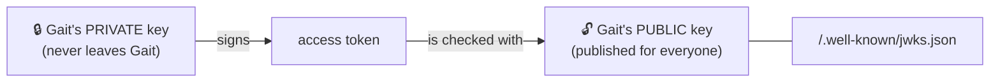

# Concepts: the ideas behind gait-sdk, in plain language

New to tokens and identity? Read this first. Everything else in the docs builds on these ideas.

## Authentication vs authorization

| | Question | Who answers it here |
|---|---|---|
| **Authentication** | *Who are you?* | **Gait**, when you log in. gait-sdk then *checks* that proof on every request. |
| **Authorization** | *What are you allowed to do?* | **Your application**, from its own data |

Mixing these two up causes most auth bugs. gait-sdk deliberately does only the first: it tells your code *who* is calling and never *what they may do*.

## Access tokens: a signed "this is who I am" note

When someone logs in, Gait hands their app an **access token**. It's a short text string (a **JWT**) in three parts:

```
eyJhbGciOiJSUzI1NiIsImtpZCI6ImsxIn0 . eyJzdWIiOiIxMjMiLCJlbWFpbCI6Ii4uLiJ9 . Sflkx…
└──────────── header ─────────────┘   └──────────── payload ──────────────┘   └ signature ┘
  which key & algorithm signed it        who this is, for whom, until when       proves nobody changed it
```

The **payload** Gait puts in every access token:

| Claim | Meaning |
|---|---|
| `sub` | **Subject**: the user's permanent id at Gait (treat it as an opaque string) |
| `email` | Their email |
| `sid` | The **session** this token belongs to, so logging out can revoke it |
| `jti` | This token's own unique id |
| `iss` | **Issuer**: which Gait made it |
| `aud` | **Audience**: which app it's meant for |
| `token_use` | Always `"access"`, so other token types can't be passed off as one |
| `iat` / `exp` | Issued at / expires at (15 minutes later) |

Notice what's **not** there: roles, organizations, permissions. That's on purpose (see [boundaries](../gait_sdk/docs/boundaries.md)).

Anyone can *read* a JWT, since the payload is only encoded, not encrypted, so never put secrets in one. What nobody can do is **change** it or **make** one, because that needs Gait's private key.

## Signatures and public keys: how your app can trust a token without asking Gait

Gait signs tokens with **RS256**, a public-key signature:



- Only the **private** key can create a valid signature, and it never leaves Gait.
- The **public** key can only *check* signatures. It's safe to publish, and Gait serves it at `/.well-known/jwks.json` (a **JWKS**, "JSON Web Key Set").
- gait-sdk downloads the public keys, caches them, and checks every token locally. **Your app never holds anything that could forge a token.**

Each key has an id, the **`kid`**, written in the token's header. That's how gait-sdk knows which public key to use, and how Gait can **rotate** keys: publish a new one, start signing with it, retire the old one later.

## Two ways to verify: local (JWKS) or ask every time (introspection)

| | **JWKS** (recommended) | Introspection (legacy) |
|---|---|---|
| How | Check the signature locally with cached public keys | Ask Gait `/whoami/` about every request |
| Speed | Microseconds, with no network call | One round-trip to Gait per request |
| If Gait is down | Keeps working for known keys | Every request fails |
| Sees a logout instantly? | ❌ Not until the token expires (≤15 min) | ✅ |

The JWKS weakness in the last row is why the live session check exists.

## Revocation and the live session check

Logging out (or an admin revoking a session) happens **at Gait**. A token that's already out there stays *validly signed* until it expires, and local verification can't know the session was ended.

For most requests, a gap of up to 15 minutes is fine. For **sensitive actions** (signing a medical report, changing someone's permissions), call `require_live_session(request)`. It asks Gait directly, *right now*, whether this session is still active:

```
revoked          → 401, nothing changes
Gait unreachable → 503, nothing changes (it fails closed and never guesses "probably fine")
active           → go ahead
```

## Access vs refresh tokens

| | Access token | Refresh token |
|---|---|---|
| Lifetime | 15 minutes | 7 days, and **rotates** every use |
| Where the browser keeps it | JavaScript memory | An **HttpOnly** cookie, invisible to JavaScript |
| Sent to | **Your API**, as `Authorization: Bearer …` | **Only Gait**, to get a new access token |
| Does gait-sdk touch it? | Yes: this is what it verifies | **Never** |

Keeping the long-lived token away from JavaScript and away from your app limits the damage of a cross-site-scripting bug or a leaked log.

## 401 vs 403 vs 503

| Code | Means | What a client should do |
|---|---|---|
| **401** Unauthorized | "I don't know who you are": the token is missing, invalid or expired, or the session was revoked | Refresh the token and retry, or send the user to log in |
| **403** Forbidden | "I know who you are, and the answer is no" (your app's rules) | Don't retry. Show "not allowed". |
| **503** Unavailable | "I couldn't check" (Gait unreachable, keys unavailable) | Retry later. Never treat it as success. |

gait-sdk is careful to return a *real* 401 (Django REST Framework otherwise silently turns it into 403, which breaks every client's refresh logic).

## Issuer, audience, subject: identity you can trust

- **Issuer** (`iss`): *who vouches for this person.* Your app only accepts one exact issuer.
- **Audience** (`aud`): *who the token is for.* A token minted for some other app is rejected, even though Gait signed it.
- **Subject** (`sub`): *who the person is.* Store it on your user or membership records. Never parse it or assume it's a number.

Together, `(issuer, subject)` is a globally unique identity.

---

Next: see it working in [examples/](../examples/) (five minutes, no account needed), then [Architecture](ARCHITECTURE.md) for how the pieces fit.
