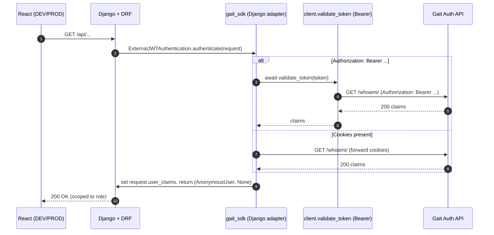

# 🔐 Gait Integration — Django Adapter (`gait_sdk/django/authentication.py`)

## 🧱 Overview
This module provides the **DRF authentication backend** that plugs Django services (e.g., Lumen Reports) into the centralized **Gait Auth API**.  
It supports **both DEV (Bearer token)** and **PROD (HttpOnly cookies)** validation flows and attaches verified user claims to each incoming request.

---

## 💡 Responsibilities
1. Extract credentials from the incoming request:
   - **DEV**: `Authorization: Bearer <token>` header
   - **PROD**: forward `request.COOKIES` to Gait
2. Call Gait `/whoami/` to validate the session
3. Attach `request.user_claims = {...}`
4. Return `(ClaimsUser(...), claims)` — a lightweight authenticated user backed by the validated claims, **not** `AnonymousUser`. There is no local Django `User` row at any point.
5. Raise proper DRF exceptions on failure, with `authenticate_header()` returning `"Bearer"` so DRF reports a real `401` instead of silently downgrading to `403` (see the root `README.md`'s "Correctness guarantee" section — this was a real bug, fixed in v0.3.12)

---

## 🔁 Validation Modes
- **Bearer mode (DEV)** → calls shared async client: `validate_token(token)`
- **Cookie mode (PROD)** → forwards cookies to Gait with an async `httpx` call

> We centralize header-based validation in `client.validate_token()`.  
> Cookie-based validation is handled here (Django-only), since FastAPI services use Bearer mode in practice.

---

## 🧩 Sequence Diagram


---

## ✅ Usage (Django / DRF)
```python
# settings.py (project settings)
AUTH_API_URL = "https://ant-django-auth-62cf01255868.herokuapp.com/api"

# views.py
from rest_framework.views import APIView
from rest_framework.response import Response
# Import from the stable public path, not this internal module directly —
# gait_sdk.authentication re-exports the same class and survives refactors.
from gait_sdk.authentication import ExternalJWTAuthentication

class WhoAmIView(APIView):
    authentication_classes = [ExternalJWTAuthentication]

    def get(self, request):
        return Response(getattr(request, "user_claims", {}))
```

---

## 🔐 Security Notes
- Never logs tokens or PHI.
- Only logs high-level validation states and HTTP status codes.
- Returns DRF-native errors: `AuthenticationFailed (401)` and `AuthServiceUnavailable (503)` — always a real 401 for auth failures as of v0.3.12, thanks to `authenticate_header()`. Before that, DRF silently rewrote it to 403.

---

Maintained by **Anthony Narine**  
© 2025 — The Lumen Project
