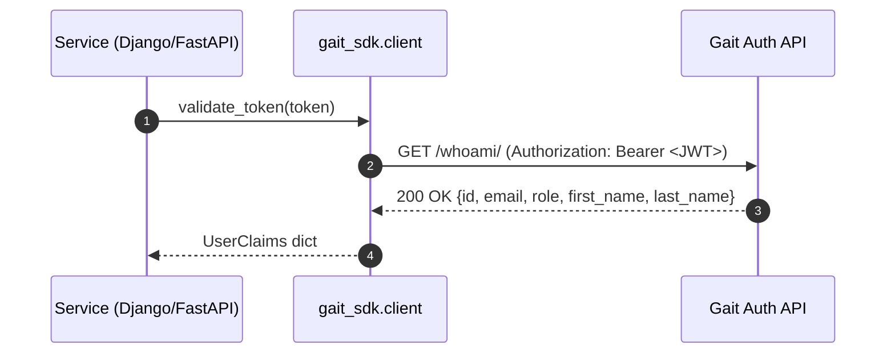

# 🧩 gait_sdk.client — Unified Async JWT Validation Client

### Purpose
The `gait_sdk.client` module provides a **framework-agnostic, asynchronous** way to validate JWT access tokens by delegating verification to the **Gait Auth API** (`/whoami/` endpoint).

It replaces the older, Django-only synchronous clients (`client.py`, `token_utils.py`) with a single non-blocking validator that can be used in **Django (DRF)** *and* **FastAPI** microservices.

---

## ⚙️ Key Features

| Feature | Description |
|----------|--------------|
| **Async I/O (httpx)** | Non-blocking, production-ready HTTP client |
| **Framework Neutral** | Works seamlessly in Django and FastAPI |
| **Centralized Error Handling** | Raises `InvalidTokenError` or `AuthServiceUnavailable` |
| **HIPAA-Safe Logging** | No tokens, PHI, or secrets ever logged |
| **Typed Output** | Returns `UserClaims` TypedDict |
| **Single Source of Truth** | Replaces all previous token validation logic |

---

## 🧠 Architecture Overview



**Mental Model:**
> `gait_sdk.client` acts like a translator — it forwards the token to Gait and returns the verified identity in a structured, framework-neutral way.

---

## 🧾 Example Usage

### Django (Sync Context)
```python
import asyncio
from gait_sdk.client import validate_token

def validate_user(token: str):
    claims = asyncio.run(validate_token(token))
    print(claims["email"])
```

### FastAPI (Async Context)
```python
from fastapi import Depends, FastAPI
from gait_sdk.client import validate_token
from fastapi.security import HTTPBearer

app = FastAPI()
security = HTTPBearer()

@app.get("/whoami/")
async def whoami(credentials=Depends(security)):
    token = credentials.credentials
    claims = await validate_token(token)
    return {"user": claims}
```

---

## 🧩 Module API Reference

### `validate_token(token: str) -> UserClaims`
**Description:**  
Validates a JWT by sending a GET request to `${GAIT_AUTH_URL}/whoami/`.

**Raises:**
- `InvalidTokenError` — Token invalid or expired (401)
- `AuthServiceUnavailable` — Auth API unreachable or malformed response

**Returns:**
```python
{
  "id": "user-123",
  "email": "tech@example.com",
  "role": "technologist",
  "first_name": "Jane",
  "last_name": "Doe"
}
```

---

## 🔒 Security & Logging

| Rule | Implementation |
|------|----------------|
| Never log JWTs | Tokens are redacted from all log messages |
| Minimal logs | Only service status + response codes |
| HIPAA-safe | Logs contain no PHI (email, MRN, names) |
| Fail closed | Any unreachable condition → `AuthServiceUnavailable` |

**Example Logs:**
```
[INFO] Validating token via https://gait.example.com/api/whoami/
[INFO] ✅ Token validated successfully (claims received)
[WARNING] Invalid or expired token (401)
[ERROR] Auth API unreachable: ConnectTimeout
```

---

## 🧱 Developer Notes

- Designed as the **core shared layer** for all `gait_sdk` adapters.  
- Can be directly imported by microservices needing low-level validation.  
- All other modules (`django/authentication.py`, `fastapi/dependencies.py`) rely on it.  
- Safe for containerized or production deployment.

---

## ✅ Summary

| Before | After |
|--------|-------|
| `requests` (blocking) | `httpx.AsyncClient` (async) |
| Django-only | Django + FastAPI |
| No logging | Secure structured logging |
| Generic exceptions | Typed API exceptions |
| Multiple sources of truth | Single unified client |

---

**Maintained by:** Anthony Narine  
© 2025 — Lumen Project (Auth Integration Refactor Initiative)
