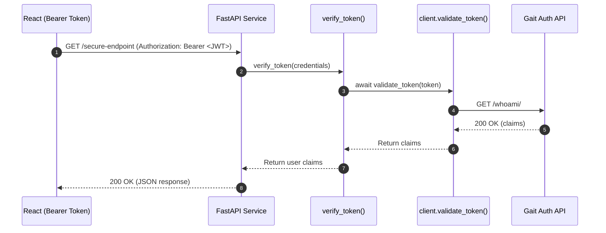

# ⚙️ Auth Integration — FastAPI Dependency (`gait_sdk/fastapi/dependencies.py`)

## 🧱 Overview
This module provides the **FastAPI authentication dependency** that validates incoming
JWT access tokens via the centralized **Gait Auth API**. It enables every FastAPI service
(Media, Dubin, HL7, Billing, etc.) to easily secure routes using standard
dependency injection with `Depends()`.

---

## 💡 Responsibilities

| Step | Action | Notes |
|------|---------|-------|
| 1️⃣ | Extract `Authorization: Bearer <token>` header | Uses FastAPI’s `HTTPBearer` |
| 2️⃣ | Validate token asynchronously | Calls shared `validate_token()` from `client.py` |
| 3️⃣ | Return verified user claims | Attached to route function as dependency output |
| 4️⃣ | Handle invalid/unreachable cases | Raises `HTTPException(401 or 503)` |
| 5️⃣ | Maintain HIPAA-safe logs | Never logs tokens or PHI |

---

## ✅ Example Usage

```python
from fastapi import FastAPI, Depends
from gait_sdk.fastapi.dependencies import verify_token

app = FastAPI()

@app.get("/reports")
async def get_reports(user=Depends(verify_token)):
    return {"user_id": user["id"], "role": user["role"]}
```

### Example Result
- ✅ Valid token → Returns user claims
- ❌ Invalid/missing token → Raises `HTTPException(401)`

---

## 🔐 Exception Mapping

| Exception Raised | HTTP Code | Description |
|------------------|------------|--------------|
| `InvalidTokenError` | 401 | Invalid or expired token |
| `AuthServiceUnavailable` | 503 | Gait Auth API unreachable |
| Generic error | 401 | Unexpected authentication issue |

---

## 🧩 Sequence Diagram



---

## 🧠 Teaching Notes

- **Dependency Injection:**  
  FastAPI uses `Depends()` to automatically call this dependency before route execution.

- **Asynchronous Validation:**  
  The dependency directly awaits `validate_token()`, ensuring non-blocking I/O.

- **HIPAA Safety:**  
  No raw tokens or PHI ever logged. Only validation outcomes and HTTP codes appear in logs.

- **Cross-Service Consistency:**  
  All FastAPI microservices (Media, Dubin, HL7) share the same authentication logic.

---

## 🧱 Internal Structure

```
gait_sdk/fastapi/dependencies.py
│
├── bearer_scheme     # Defines FastAPI's HTTPBearer security scheme
├── verify_token()    # Main dependency for route protection
└── get_current_user()# Optional helper for accessing request.state.user
```

---

## 🔗 Related Modules

| Module | Purpose |
|---------|----------|
| `client.py` | Shared async JWT validator (httpx) |
| `settings.py` | Loads GAIT_AUTH_URL and timeout |
| `django/authentication.py` | DRF adapter using same validation logic |

---

Maintained by **Anthony Narine**  
© 2025 — The Lumen Project
